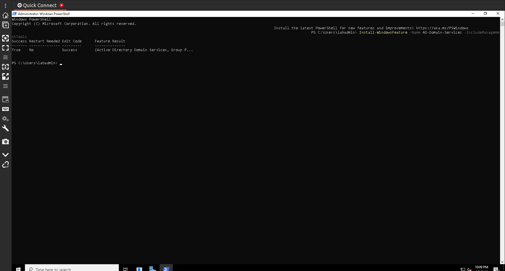
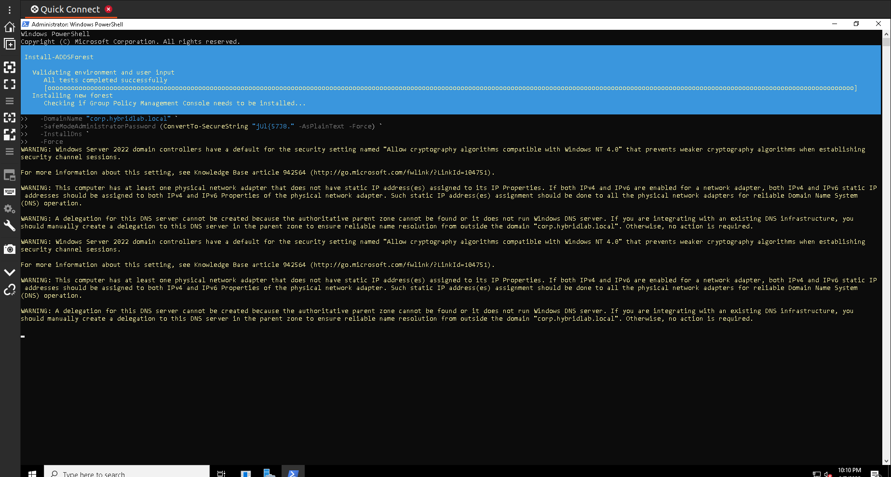
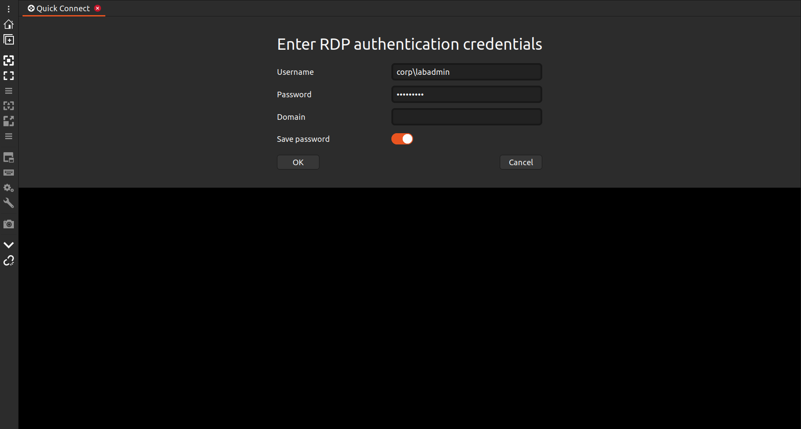
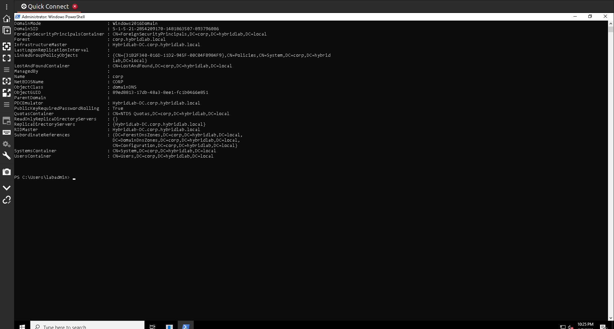
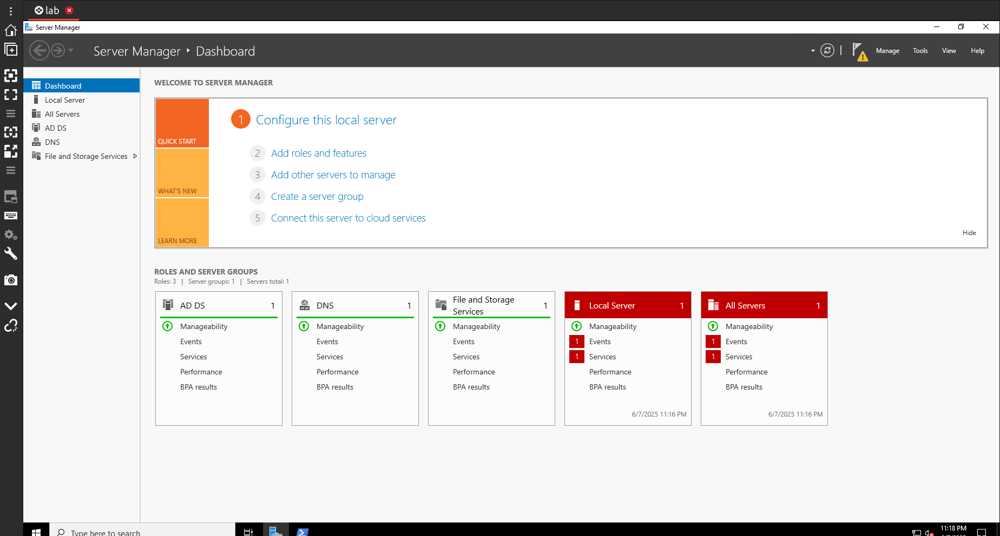

# 🎩 Phase 1 – Step 3: Connect and Promote Domain Controller

## 📚 Table of Contents

* [📌 Overview](#-overview)
* [🎯 Objectives](#-objectives)
* [🧠 Key Concepts Reinforced](#-key-concepts-reinforced)
* [🧰 Lab Environment & Tools](#-lab-environment--tools)
* [🔧 Tasks Performed](#-tasks-performed)
* [📈 Outcome Summary](#-outcome-summary)
* [🏢 Business Relevance](#-business-relevance)
* [🖼️ Screenshots](#-screenshots)
* [🙏 Acknowledgments](#-acknowledgments)

---

## 📌 Overview

In this step, I connected to my Windows Server 2022 VM and completed the promotion process to make it a fully functional domain controller. This included a clean reinstallation of the AD DS role and a seamless forest/domain creation using PowerShell. Getting this right was critical because the domain controller becomes the authoritative identity source in my hybrid lab, enabling secure user and device management across both on-premises and cloud environments.

---

## 🎯 Objectives

* Reinstall the Active Directory Domain Services (AD DS) role to ensure a clean setup
* Promote the server to a domain controller using PowerShell
* Create a new domain forest: `corp.hybridlab.local`
* Validate that the promotion completed successfully and the server rebooted automatically

---

## 🧠 Key Concepts Reinforced

| Concept                                  | Description                                                                                                 |
| ---------------------------------------- | ----------------------------------------------------------------------------------------------------------- |
| Active Directory Domain Services (AD DS) | Enables centralized identity management and domain-based authentication.                                    |
| Domain Controller (DC)                   | A Windows Server that handles login requests and enforces domain policies.                                  |
| Forest                                   | The top-level container for a group of domains in AD DS; I created a new one called `corp.hybridlab.local`. |
| Directory Services Restore Mode (DSRM)   | A special boot mode used for AD recovery, secured by a dedicated password set during promotion.             |
| PowerShell Automation                    | Used for repeatable, efficient domain setup and server role promotion.                                      |

---

## 🧰 Lab Environment & Tools

* Windows Server 2022 (Standard\_D2s\_v3)
* Remote Desktop (Remmina on Linux)
* PowerShell (run as Administrator)
* Azure Portal (for VM and NSG management)
* Domain Name: `corp.hybridlab.local`

---

## 🔧 Tasks Performed

1. Connected to the Windows Server via Remmina RDP.
2. Opened Windows PowerShell as Administrator.
3. Reinstalled the AD DS role using:

   ```powershell
   Install-WindowsFeature -Name AD-Domain-Services -IncludeManagementTools
   ```
4. Verified the installation completed without errors.
5. Promoted the server to a domain controller with the following command:

   ```powershell
   Install-ADDSForest -DomainName "corp.hybridlab.local" -SafeModeAdministratorPassword (ConvertTo-SecureString "7^S~f$ZA3E2D~UK" -AsPlainText -Force) -Force
   ```
6. Observed the server reboot automatically after successful promotion.
7. Logged back in to confirm domain controller functionality via Server Manager.
8. Verified that both the AD DS and DNS roles were installed and healthy.

---

## 📈 Outcome Summary

By the end of this step, I had a cleanly promoted domain controller running in Azure. The new forest `corp.hybridlab.local` was created successfully, and the server rebooted as expected. Server Manager confirmed that AD DS and DNS were functioning normally — Phase 1 Step 3 is now complete.

---

## 🏢 Business Relevance

Deploying a domain controller in a hybrid lab mimics real-world enterprise identity infrastructure. It represents the on-premises identity anchor that many organizations still rely on, even while transitioning to cloud-native identity with Microsoft Entra ID. Understanding how to configure and promote a domain controller using PowerShell is critical for system administrators, cloud engineers, and identity professionals.

---

## 📸 Screenshots – Phase 1 Step 3: Connect and Promote Domain Controller

| # | Screenshot | Description |
|---|------------|-------------|
| 1 |  | The Active Directory Domain Services (AD DS) role was successfully installed using PowerShell with `Install-WindowsFeature -Name AD-Domain-Services -IncludeManagementTools`. |
| 2 |  | A new AD forest was created using `Install-ADDSForest`, promoting the server as a domain controller for `corp.hybridlab.local`. Warnings about DNS delegation and security settings were displayed. |
| 3 |  | Successful RDP login attempt using the domain credentials `corp\labadmin`, confirming that domain services are active and accepting logins. |
| 4 |  | `Get-ADDomain` output confirms the server is now a fully functional domain controller. Key roles like RID Master and PDC Emulator are listed. |
| 5 |  | Server Manager confirms successful installation of AD DS, DNS, and File and Storage Services. The domain controller is fully promoted and manageable. |


---

## 🙏 Acknowledgments

Thanks to Microsoft for providing the tools to build hybrid enterprise labs and to the PowerShell community for enabling automation. I used AI assistance to plan and document this lab effectively while following best practices for clarity and reproducibility.

