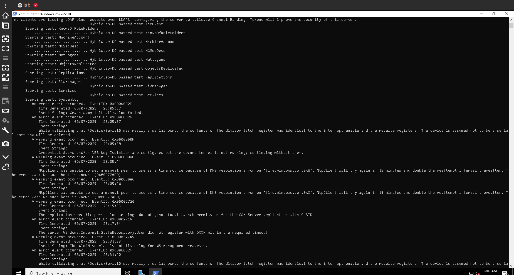
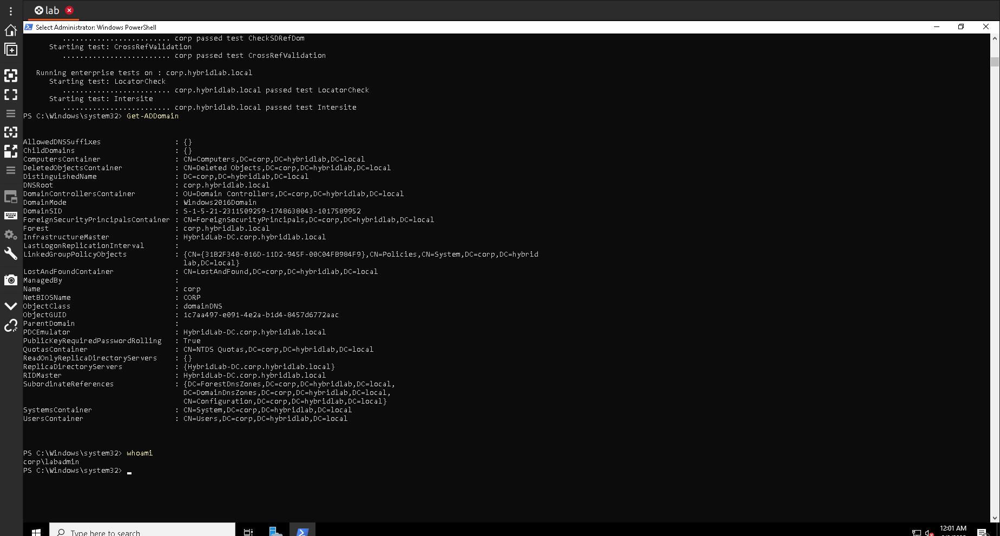

🎩 **Hybrid Identity Lab: Phase 1 Step 4 – Verify Domain Controller Functionality**

---

## 📚 Table of Contents

* [Overview](#-overview)
* [Objectives](#-objectives)
* [Key Concepts Reinforced](#-key-concepts-reinforced)
* [Lab Environment & Tools](#-lab-environment--tools)
* [Tasks Performed](#-tasks-performed)
* [Outcome Summary](#-outcome-summary)
* [Business Relevance](#-business-relevance)
* [Screenshots](#-screenshots)
* [Acknowledgments](#-acknowledgments)

---

## 📌 Overview

After successfully promoting my server to a domain controller, this step focused on verifying that the AD DS setup was functional and ready for hybrid integration. My primary goal was to ensure that Active Directory Domain Services (AD DS) was fully operational and properly integrated into the `corp.hybridlab.local` forest. This is a critical checkpoint before configuring identity synchronization with Microsoft Entra ID.

---

## 🎯 Objectives

* Confirm the successful promotion and health of the domain controller.
* Validate DNS configuration to ensure proper name resolution.
* Test login using `corp\labadmin` domain credentials.
* Create a VM snapshot to preserve a known good state.

---

## 🧠 Key Concepts Reinforced

| Concept                   | Explanation                                                                                                                                                  |
| ------------------------- | ------------------------------------------------------------------------------------------------------------------------------------------------------------ |
| Domain Controller Health  | Ensuring AD DS services are running, replication is functional, and DNS is properly registered. Tools like `dcdiag` are used to evaluate domain health.      |
| DNS in Active Directory   | DNS is critical for AD, as domain controllers publish key services (Kerberos, LDAP, etc.) via DNS. A misconfigured DNS can lead to widespread domain issues. |
| Domain Account Syntax     | Domain login requires correct syntax, like `DOMAIN\\username` or `username@domain.com`. Local logins can be accessed using `.\\username`.                    |
| Virtual Machine Snapshots | Snapshots allow easy rollback before major changes. Ideal for labs and production pre-checkpoints.                                                           |

---

## 🧰 Lab Environment & Tools

* **Virtual Machine**: Azure-hosted Windows Server 2022 (hybrid-ad-ds)
* **Networking**: Static IP address
* **Command Line Tools**: PowerShell (Admin), `dcdiag`, `Get-ADDomain`, `whoami`
* **Virtualization Platform**: Azure (for VM snapshots)

---

## 🔧 Tasks Performed

* Rebooted the VM to initialize all AD DS services post-promotion.
* Attempted login using `corp\labadmin`; used `.\labadmin` as fallback while services loaded.
* Opened PowerShell as Administrator and ran:

  * `dcdiag` to assess DC health.
  * `Get-ADDomain` to confirm domain configuration.
  * `whoami` to verify domain vs local account context.
* Validated that `corp.hybridlab.local` was functional and correctly promoted.
* Successfully switched to domain login using `corp\labadmin` once services stabilized.
* Created a VM snapshot in Azure for recovery and rollback.

---

## 📈 Outcome Summary

I successfully verified the functionality of my domain controller and confirmed that `corp.hybridlab.local` is fully operational. I am now able to log in using domain credentials, and critical Active Directory services are running as expected. This completes the foundational setup for my on-premises Active Directory environment.

---

## 🏢 Business Relevance

Verifying domain controller functionality is a non-negotiable step in any enterprise-level Active Directory deployment, especially in a hybrid identity scenario. A robust and healthy on-premises AD DS environment is the cornerstone for seamless identity synchronization with Microsoft Entra ID. Issues at this stage can cascade into major authentication, policy enforcement, and access control failures. By confirming stability here, I’m laying the groundwork for a secure and scalable identity system.

---

## 🖼️ Screenshots

| Screenshot | Description |
|------------|-------------|
|  | Output from `dcdiag` showing domain controller health checks and validation of key AD DS services. |
|  | PowerShell output showing `Get-ADDomain` response (showing domain “corp.hybridlab.local”) and `whoami` verifying login as `corp\labadmin`. |

---

## 🙏 Acknowledgments

Thanks to Microsoft for the robust tools that make identity infrastructure manageable and extensible. Special acknowledgment to AI-powered tools for supporting documentation accuracy and helping streamline the verification process.
