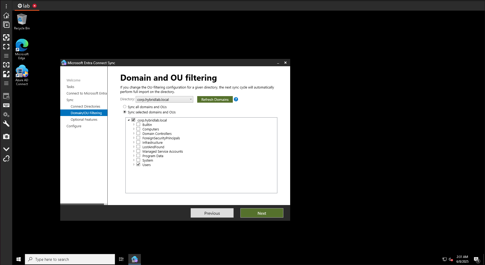
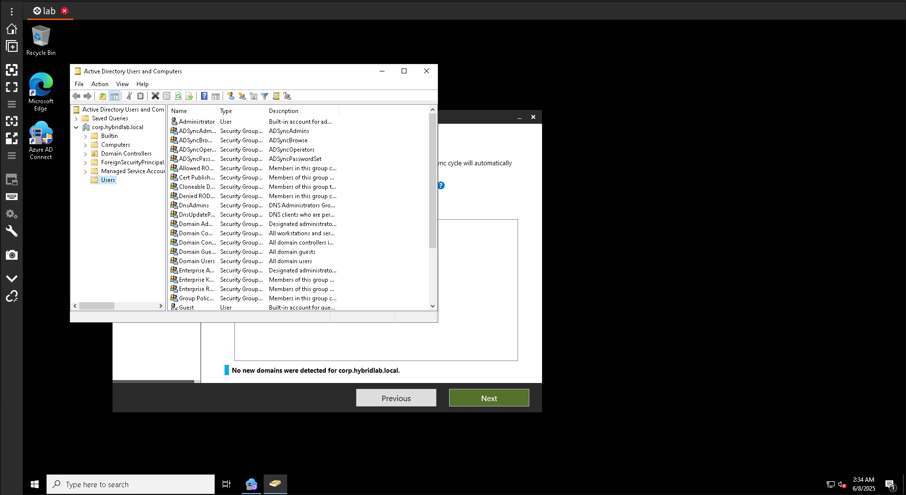
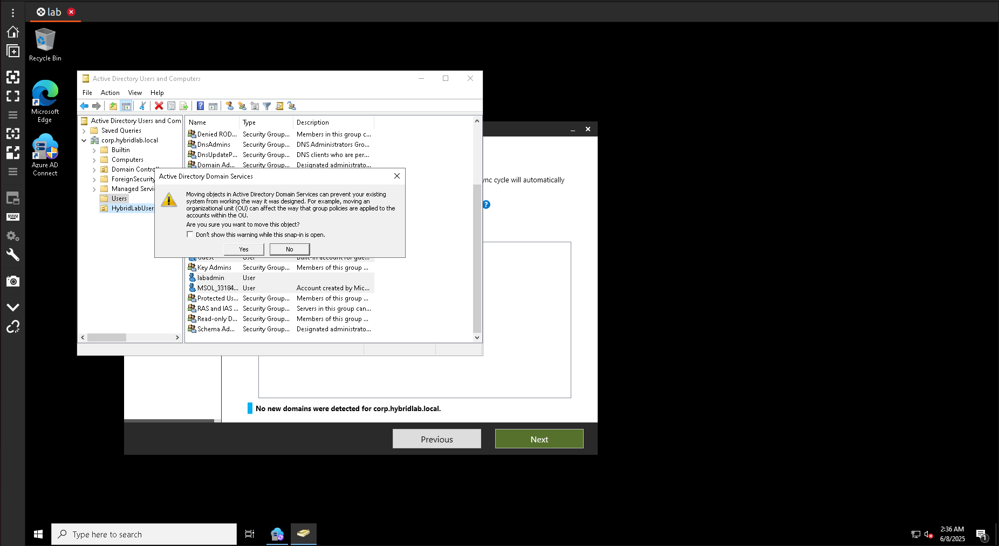
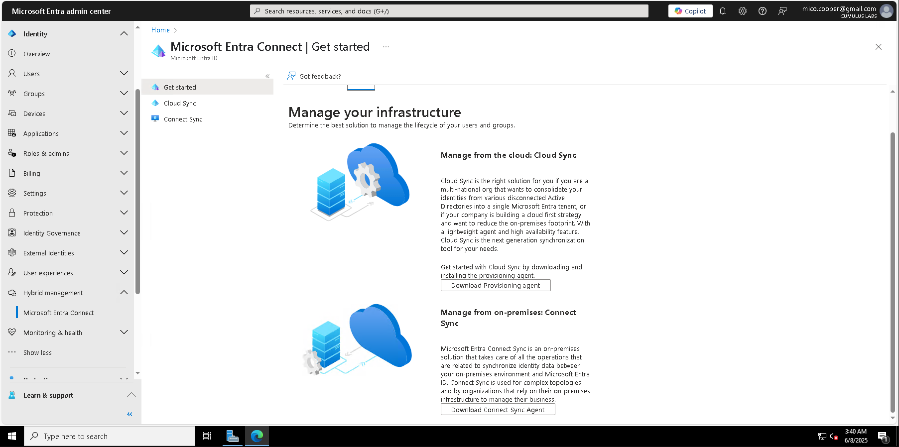
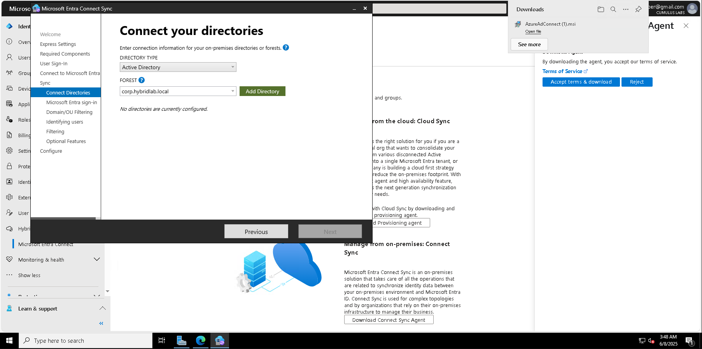
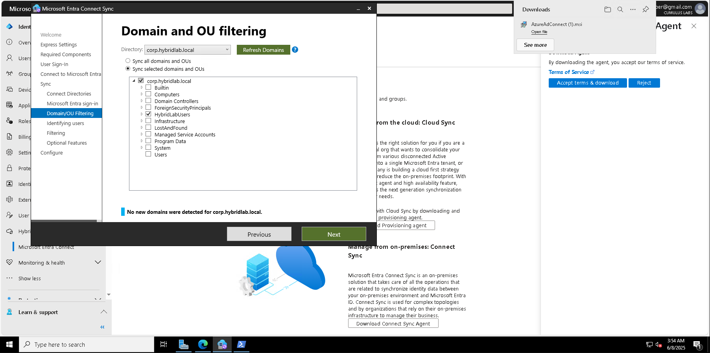
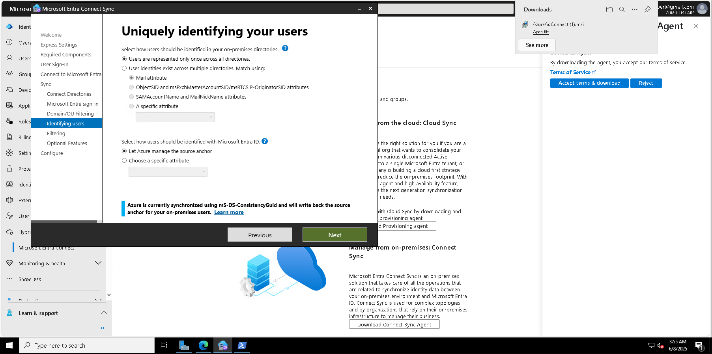
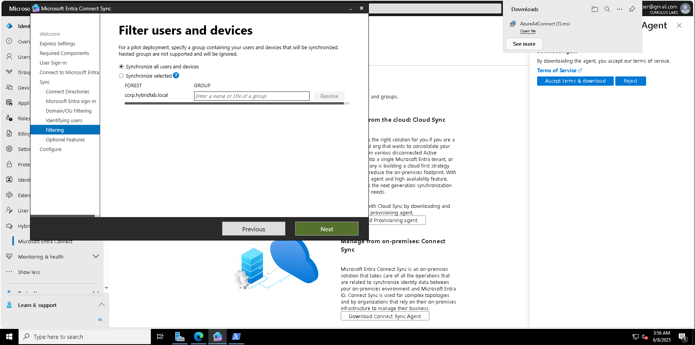
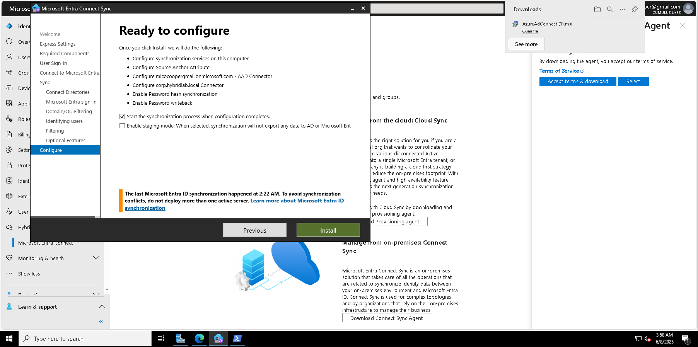
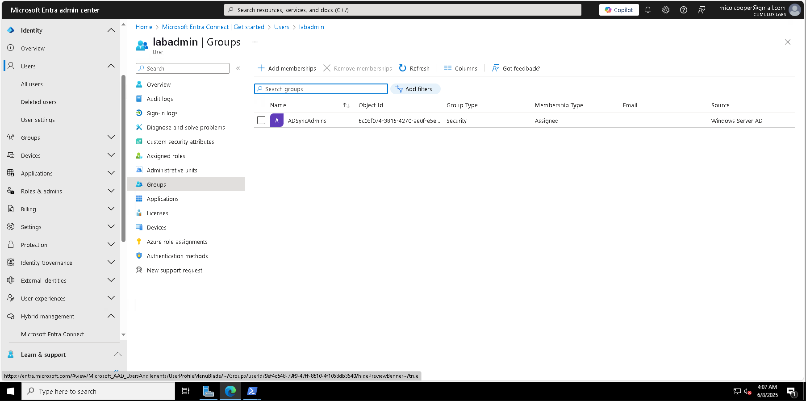

# Phase 3 – Hybrid Identity Verification & OU Filtering

## 📌 Overview
Phase 3 focused on verifying Active Directory synchronization into Microsoft Entra ID and scoping synchronization using **OU filtering**. This ensures only designated users and groups are synced to the cloud, following least-privilege best practices. The process concludes with confirming that the test account (`labadmin`) is successfully visible in Entra.

---

## 🎯 Objectives
- Run through the full Azure AD Connect configuration wizard.  
- Scope synchronization to a custom OU (`HybridLabUsers`).  
- Validate that objects (users, groups) sync correctly into Microsoft Entra.  
- Confirm `labadmin` appears in Entra with **Source = Windows Server AD**.  

---

## 🛠️ Lab Environment
- **On-Premises**: Windows Server 2022 Domain Controller (`corp.hybridlab.local`)  
- **Azure**: Microsoft Entra ID tenant  
- **Tools**:  
  - Microsoft Entra admin center  
  - Azure AD Connect Sync  
  - Active Directory Users and Computers (ADUC)  

---

## 🖼️ Screenshots & Steps

### Step 1 – Launch Additional Tasks
  
Opened Azure AD Connect and selected **Customize synchronization options** to begin advanced configuration.

---

### Step 2 – OU Filtering (Initial View)
  
Initial OU filtering screen showing all OUs under `corp.hybridlab.local`.

---

### Step 3 – Review Users Container in ADUC
  
Verified built-in accounts and groups in the **Users** container before moving test accounts.

---

### Step 4 – Move Test User to HybridLabUsers OU
  
Moved `labadmin` into the custom `HybridLabUsers` OU to scope it for synchronization.

---

### Step 5 – Entra Connect Get Started Page
  
Entra Connect page comparing **Cloud Sync** vs. **Connect Sync**. This lab uses **Connect Sync**.

---

### Step 6 – Connect Your Directories
  
Added `corp.hybridlab.local` as the forest to be synchronized with Microsoft Entra.

---

### Step 7 – OU Filtering with HybridLabUsers
  
Scoped sync to only the **HybridLabUsers** OU, following best practices for least privilege.

---

### Step 8 – Identifying Users
  
Set **mS-DS-ConsistencyGuid** as the source anchor, allowing Azure to manage user identities consistently.

---

### Step 9 – Filter Users and Devices
  
Kept default option to **synchronize all users and devices**, since OU filtering already scoped sync.

---

### Step 10 – Ready to Configure
  
Final review screen confirming: Password Hash Sync + Password Writeback enabled, OU filtering applied, sync ready to start.

---

### Step 11 – Verification in Microsoft Entra
  
Confirmed that `labadmin` successfully synced into Entra with **Source = Windows Server AD** and group membership intact.

---

## 📊 Outcome
- ✅ Scoped synchronization to `HybridLabUsers` OU.  
- ✅ Completed full Azure AD Connect configuration wizard.  
- ✅ Enabled Password Hash Sync and Writeback.  
- ✅ Verified that the `labadmin` user synced successfully to Microsoft Entra.  

Hybrid Identity is now **operational and validated**.

---

## 💼 Business Relevance
Scoping synchronization via OU filtering ensures that only authorized accounts are synced to the cloud, reducing security risks. This setup aligns with enterprise IAM practices by combining **on-prem AD** with **Microsoft Entra** for a hybrid identity model.

---

## 🙏 Acknowledgments
Thanks to Microsoft for the robust tools that make identity infrastructure manageable and extensible. Special acknowledgment to AI-powered tools for supporting documentation accuracy and helping streamline the verification process.
- Microsoft Learn: [Azure AD Connect documentation](https://learn.microsoft.com/azure/active-directory/hybrid/whatis-azure-ad-connect)  
